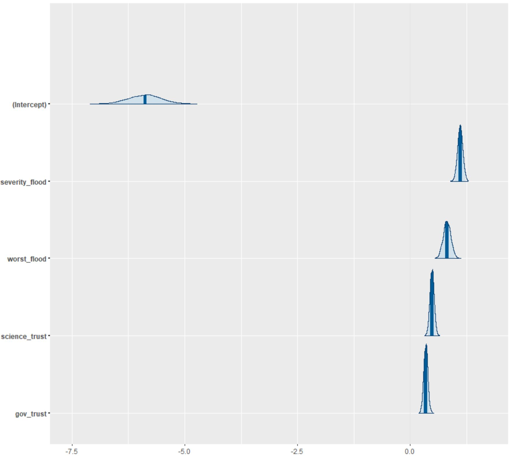

```{r setup, include=FALSE}
knitr::opts_chunk$set(echo = TRUE)

```
## Introduction ##

Risk perception is a fundamental way to characterize a person’s intuitive risk judgement and allows for the identification, characterization, and quantification of risk.  Past literature has argued that those with higher risk perception are more likely to take caution and prepare for natural hazards such as floods, fires, earthquakes, etc. [@vinh_hung2007]. However, several studies have found a lack of correlation between high risk perception’s effect on protective behavioral actions towards natural disasters; Wachinger and coauthors (2013) identify this unexpected response as the “Risk Perception Paradox.” [-@wachinger2013] 

There are several factors that determine a person’s risk perception. The first area is direct experiences which have been found to have an amplificatory effect on risk perception; this includes an individual's personal experiences with natural hazard events (the largest effect) and stakehold in the community such as home ownership [@lujala2015]. The second important area of influence is trust both for scientific technology and authorities to ensure that they are being used to protect against natural hazards [@wachinger2013; @viglione2014]. While this has been researched at the layperson level, this effect has not been investigated at the authority level. Understanding how an individual's trust in science and the federal government may influence technology adoption could improve effective flood risk management. Trust in science will assess whether the person trusts the scientific information that is being provided to them about how to best manage their flood risk. Trust in the federal government will specifically assess how the flood risk managers view the usefulness and accuracy of flood risk management products provided to them from the federal government. Numerous studies have showed the crucial role trust plays in building innovation, adaptive capacity, and resilience into a system, whether that system in ecological, technological, or social [@chapin2010; @luo2010; @viglione2014]. 

The third important area that could play an effect in a person’s risk perception is their belief in the potential for increased size and frequency of natural hazard events in their community. There are mixed results on the effect of increased frequency and size of events on an individual’s risk perception [@wachinger2013]. Some studies have found there to be an significant impact from a person’s environmental beliefs and their behavioral intentions [@oconnor1999]. This analysis wil investigate if there is a correlation between environmental beliefs and risk perception which could consequently then affect an individual's behavioral intentions. Lastly, demographics play a significant role in risk perception and will be taken into account during this analysis [@savage1993]

This research project will examine the risk perception paradox to determine if risk perception is or isn't reflected in a flood risk manager's decision to adopt a new technology called Light Detection and Ranging (lidar). Lidar is a laser-based survey instrument that captures a high-resolution spatial image of the earth's surface (e.g. 1-meter resolution). The current literature calls for a theoretical framework to quantify flood risk in a way that accurately takes into account the social dimension side of risk through the inclusion of risk perceptions [@birkholz2014; @kellens2013]. This work aims to create a theoretical framework that can be replicated to assess risk perceptions for other types of hazards, as well as locations to ultimately help decrease vulnerability and increase adaptive capacity and resilience in communities. The main objectives of this work are: 

  1. Use a survey instrument to assess four predictor categories of risk perception: direct experience, trust, environmental beliefs, and demographics. In addition, identify if survey respondent uses lidar.
  
  2. Create a model that can accurately describe the relationship between risk perception and lidar use. 

## Hypotheses ##

Hypothesis 1 (H1): Flood risk managers with greater perceived risk of damaging floods are more likely to adopt lidar. 

Null: Perceived risk does not affect adoption of lidar in flood risk managers. 

Hypothesis 2 (H2): Direct experiences will have a more significant effect on lidar use, than other risk perceptions measures of trust, environmental beliefs, and demographics. 

Null: Direct experiences with floods will have the same affect as trust, environmental beliefs, and demographics on the adoption of lidar. 

## Methods ##

*Data Collection*

All of the predictors as well as the response variable will be collected by a survey instrument (Appendix A). This is a modified survey instrument that was made specifically for this project, however it is part of a larger survey that will be sent out to flood risk managers across the state of Idaho. However, we have not sent this survey out for response yet, so instead we simulated data with the exact questions. Within each category of risk perception, there are additional sub-variables that are outlined in Table 1. In addition, the survey asks the respondent whether they currently use lidar or not which gathers the response variable data. 

![Table 1. This shows four main categories of predictors: direct experience, trust, environmental beliefs, and demographics. These four predictor categories make-up a person's risk perception. Within these four categories are several sub-variables that are potential canidates for this analysis. Direct experience includes typical community flood events, the worst community flood event, the economic cost of floods per year, and if a community has inaccurate flood maps. The trust category is made up of the respondent's trust in science and the federal government. The environmental beliefs category is made up of the respondent's climate change beliefs measured by their belief in changing number and severity of flood, as well as their community's preparedness. The fourth category is the respondent's demographics which include age, gender, education level, and political party.](variable_chart.jpg)

*Data Simulation*

This analysis has multiple variables so we created a directed acyclical graph (DAG) to explain how the categories of predictors may influence one another and to help identify any potential confounders. 


 
Starting with this DAG in mind, we began the data analysis with data simulation. The first step in this process was to specify the number of respondents (N=2000) and the slope estimates for each predictor value. We began with 12 predictor values and decided to narrow down the predictors due to possible confounders. Specifically, we believed there is potential for increasing number and severity of floods to be correlated, so for the purposes of this example we decided to leave out the increasing severity of flood variable. There is also potential for age and political party to be correlated, so for the purposes of this example we left out age. Lastly, we decided to leave out education in order to simplify the number of variables in this simulation. After removing these three predictors we were left with nine predictors. 

*Model Fitting and Comparison*

All statistical analyses were conducted in R using rstanarm. We assessed our hypotheses with a Bayesian approach and given the binary structure of our response variable, we used a binomial generalized linear multilevel model (GLMM). For each model, we ran four MCMC chains, each with 2,000 samples in the parameters’ posterior distributions (in addition to a 1,000 iteration warm up period). We assessed effective sample size and checked model convergence, indicated by R-hat statistics close to 1 and stable, well-mixed chains (Gelman and Rubin 1992).

First, we ran a model with all nine predictor variables. We considered predictors that had parameter estimates whose 90% credible interval did not overlap with zero to be important because it is likely that those predictors have non-zero effects on the outcome variable of interest, lidar use. From this, we were able to identify that flood severity, worst flood, trust in science, and trust in government had non-zero effects on lidar use. Next, we created two additional models to compare to the full model to determine which model had the best fit. The second model included the four predictors that were determined to have a non-zero effect from the full model and the third model looked at direct experience predictors only on lidar use. Model 1 was chosen because it had the greatest comparative out-of-sample (OOS) predictive performance shown by using a Loo Information Criteria (LOOIC) comparison using the loo package in R.

Next, Model 1 was run with a zero-inflated binomial distribution using the brms package in R to determine if there was a significant effect from potential non-response bias that can accompany survey results. Then, model 1 and the zero-inflated model LOOIC values were compared using the loo package in R. Since model 1 had the lowest OOS prediction error, our analysis took a closer look at the model fit and predictive ability of that model. 

*Model interpretation and Communication*

The package rstanarm was used to assess the model fit of model 1 using a Bayesian r-squared. In addition, both the prior and posterior distributions were looked at in order to understand our model further. We kept the default weakly conservative priors from the package rstanarm because our model had a lower OOS prediction error than the model that included specified priors. A boxplot was used to display the effect of each predictor, while holding the other predictors at their minimums in order to analyze the isolated effect of each predictor on lidar use. Finally, we looked at the predictive performance of a null model against model 1, using a LOOIC comparison from the loo package in R. 

 
## Results ##

Model 1 without priors had the greatest OOS predictive performance relative to the full model, model 2, model 1 with priors, and null model. 

Table 2. displays the comparative out-of-sample (OOS) predictive performance using the Loo Information Criteria (LOOIC) across all models in used in this analysis. The expected log predictive density (elpd) difference shows that Model 1 has the greatest predictive performance out of all the models and is significantly more accurate than the null model. 

Model               | elpd_diff | se_diff |
------------------- | --------- | ------- |
sim.survey.mod1     |  0.0      | 0.0     |
sim.survey.fullmod  | -1.6      | 3.6     |
mod1.priors         | -4.1      | 3.0     | 
sim.survey.mod2     | -51.2     | 10.2    | 
sim.survey.nullmod  | -340.4    | 23.1    |


The remaing results analysis focused on model 1 parameter estimates, significant values, predictive performance, and model fit.  The simulated data slope parameter estimates were set for flood severity, worst flood, trust in science, trust in government as 1, 0.8, 0.5, and 0.3. Model 1 was able to pull back out similar parameter estimates as seen in Table 3 below. 

Table 3. This shows the results from model 1, assessing the effect of risk perception of lidar use. 

Parameters          | Estimate | Std. error |  CI (10%) |  CI (50%) |  CI (90%) |
------------------- | -------- | ---------- | --------- | --------- | --------- |
Intercept           |  -5.9    |  0.4       | -6.4      |  -5.9     | -5.4      |
Flood severity      |  1.1     |  0.1       | 1.0       |  1.1      |  1.2      |
Worst flood         |  0.8     |  0.1       | 0.7       |  0.8      |  0.9      |
Trust in science    |  0.5     |  0.0       | 0.4       |  0.5      |  0.5      |
Trust in government |  0.3     |  0.0       | 0.3       |  0.3      |  0.4      | 

These results show that each of these predictors has a non-zero effect on lidar use. Furthermore, we looked at the credible interval around these parameter estimates as shown in Figure 1. 



This data supports hypothesis one because it displays that risk perception and lidar use are highly correlated. Furthermore, the data supports hypothesis two because direct experiences (flood severity and worst flood) have a more significant effect on risk perception than the other three predictor categories of trust, environmental beliefs, and demographics. This model used the default weakly information priors for flood severity, worst flood, trust in science, and trust in government which were 1.79, 3.07, 1.77, and 1.77 respectively. 

The effect of each predictor on lidar use was assessed using a box plot where all the other predictor variables were held constant at their minimum categorical level of 1. 


Overall, each predictor had a positive correlation with lidar use. Furthermore, the predictive power of this model was assessed using a Posterior Predictive Checking (PPC) from the bayesplot package in R. 


Lastly, the Bayesian R-squared value for this model was 0.36, which represents a moderate effect size in social science data [@ferguson2009].
  

## Discussion ##

The results from this analysis show that there is a positive relationship between severity of flood, worst flood, trust in science, and trust in the government on lidar use. This relationship is shown explicitly in Figure 2. These results support our first hypotheses that individuals with higher risk perception are more likely to adopt lidar. Furthermore, the results support our second hypothesis that direct experiences with floods will have a greater effect than other components of risk perception trust, environmental beliefs, and demographics. This is supported by the plots in Figure 2, as well as the credible intervals in Figure 1 that show both severity of flood and worst flood having the most significant effect on lidar use out of all nine predictor variables. 

These results match what we expected based on the current risk perception literature that has found direct experiences to be the most influential component of risk perception [@lujala2015]. However, model 1 also included other factors such as trust of individuals which actually helped improve the model's predictive ability. This is supported from previous research that has found that trust plays a significant role in technology adoption [@chapin2010; @luo2010; @viglione2014]. Additionally, there is tension in the literature on the impact of environmental beliefs on risk perception [@wachinger2013]. Our results suggest that environmental beliefs do not play a significant role in risk perception. 

These results contribute to our understanding of risk perception and technology adoption, specifically in the realm of flood risk management. Our analyses show the importance of direct experiences and trust in technology adoption. This information can help governmental bodies such as the Federal Emergency Management Association (FEMA) understand how to connect with flood risk managers in a way that effectively increases the use of lidar to minimize risk. Primarily, our results suggest that FEMA should focus on individuals who have not experienced floods and lack trust in the government and science in order to improve flood risk management practices. 

There are limitations to this study that need to be considered. First, our methods did not account for the ordered categorical nature of our predictors in the analysis which could potentially result in different effects on lidar use than our method produced; therefore, the model assumed the difference between category 1 and 2 to be the same as the difference between 3 and 4 which in fact is not the case in our predictors. Second, this model did not include indirect experiences which also do play a role in risk perception [@wachinger2013]. Future research needs to be done in order to address potential differences in results with the inclusion of ordered categorical predictor classification, as well with the inclusion of indirect experience predictors. 
  
-----------------

## Appendix ##

# Appendix A #

**Survey Instrument**

Q1. Light Detection and Ranging (lidar) is a laser-based technology that provides a detailed data map of bare earth, canopy, and other model’s of the earth’s surface. Do you currently use lidar?

o	Yes 
o	No 


Q2. How severe are the consequences of flooding in your community, typically?

o	Minor-- no disruption of affected area 
o	Minimal-- short term minor economic consequences. Relocation and evacuation are not normally necessary. 
o	Moderate-- affected areas are disrupted; some areas evacuated or not habitable; dollar losses small but of consequence to those impacted; roads closed for short periods.  
o	Significant-- affected areas are essentially shut down; homes and/or basements flooded; economic losses are significant; requires temporary relocation of some; roads close for several hours; community infrastructure damaged.  
o	Disastrous-- equivalent to a major riverine flood; major community disruption; temporary relocation of many in affected areas; severe economic losses in affected areas; break up of social cohesion 


Q3. What is the worst consequence of flooding your community has experienced?

o	Minor-- no disruption of affected area 
o	Minimal-- short term minor economic consequences. Relocation and evacuation are not normally necessary. 
o	Moderate-- affected areas are disrupted; some areas evacuated or not habitable; dollar losses small but of consequence to those impacted; roads closed for short periods. 
o	Significant-- affected areas are essentially shut down; homes and/or basements flooded; economic losses are significant; requires temporary relocation of some; roads close for several hours; community infrastructure damaged. 
o	Disastrous-- equivalent to a major riverine flood; major community disruption; temporary relocation of many in affected areas; severe economic losses in affected areas; break up of social cohesion 


Q4. Do you think your community's floodplain maps accurately reflect flood risk?

o	Yes 
o	No 


Q5. In the future, do you think the number of flood events (of any level) in your community will increase, decrease, or stay the same as the current average?

o	Increase 
o	Decrease 
o	Stay the same 

Q6. In the future, do you think the severity of flood damage in your community will increase, decrease, or stay the same as the current averages?

o	Increase 
o	Decrease 
o	Stay the Same 

Q7. If you had to say, is your community prepared for a significant flood event?

o	Completely prepared 
o	Somewhat prepared 
o	Neither prepared nor unprepared 
o	Somewhat unprepared 
o	Completely unprepared 

Q8. What gender do you identify with?

o	Male 
o	Female 
o	Other 

Q9. What is your age?

o	Less than 20 years 
o	20-29 years 
o	30-39 years 
o	40-49 years 
o	50+  years 

Q10. What is the highest level of education you have completed?

o	Some high school 
o	High school diploma 
o	College education, did not graduate  
o	College education, Associates degree 
o	College education, Bachelor’s degree 
o	Advanced degree (MA, JD, MBA, PhD) 

Q11. If you are registered with a political party, in which one are you registered?
o	Democrat 
o	Independent 
o	Republican 
o	Other: ________________________________________________

Q12. How much do you trust or distrust science as a source of information to improve flood risk management?

o	Strongly trust 
o	Somewhat trust 
o	Neither trust nor distrust 
o	Somewhat distrust 
o	Strongly distrust 

Q13. How much do you trust or distrust the federal government's intent with flood risk management (i.e. data collection, accurate mapping, floodplain modeling, flood insurance)?

o	Strongly trust 
o	Somewhat trust 
o	Neither trust nor distrust 
o	Somewhat distrust 
o	Strongly distrust 

-----------------
# References
